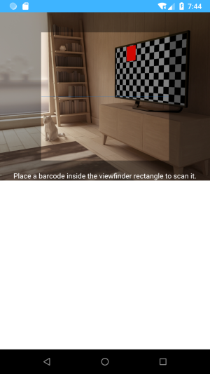

# weex-scanner
Weex custom component for barcode scanner, based on [ZXing Android Embedded](https://github.com/journeyapps/zxing-android-embedded)




## \<scanner\>

Render a qrcode scanning view.

### How to use

  ```vue
  <scanner class="scanner" @decoded="handleResult"></scanner>
  ```

- add listener on `decoded` event, to get the decoded value

  ```js
  methods: {
    handleResult(e) {
      this.decodeResult = e.value;
    },
  }
  ```

### Events

  - `decoded`

    When the qrcode is recognized, it will fire the `decoded` event.

    ```js
    {
        value: 'decoded text'
    }
    ```
